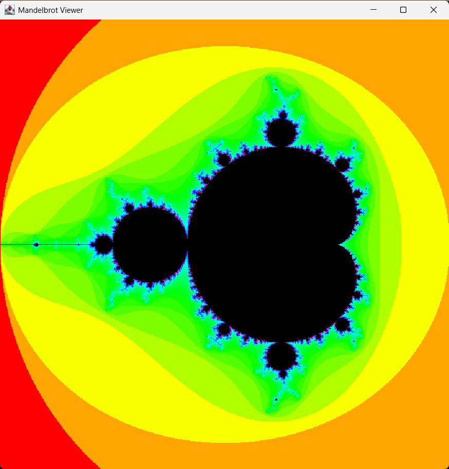

# Mandelbrot Fractal Viewer (Java)

Explore the beauty of the Mandelbrot Set using Java + Swing.

## 🌀 Features
- 🔍 Zoom in/out with mouse wheel
- 🖱 Click to center view
- 🖐 Drag to pan the fractal
- 🌈 Beautiful color gradients using escape-time algorithm
- 🧠 Real-time rendering with optimized iteration limit

